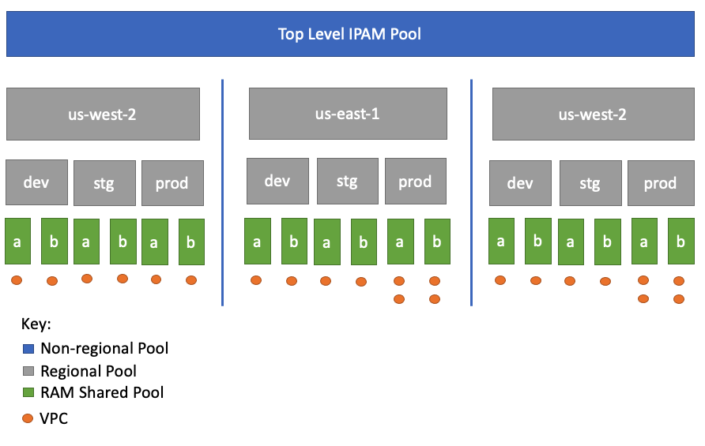

# AWS IP Address Manager Deployment Module

This module can deploy simple or complex AWS IP Address Manager (IPAM) configurations. It is designed to be flexible for many different use cases. The most common use cases (IPAM designs) are highlighted in the [examples/](./examples/) directory. Below is a representation of a symmetrically nested, multi-region deployment that is possible; Its also possible to do [asymmetically nested deployments](images/asymmetrical_pool_structure.png) as well which we have as an [example](./examples/basic).

## Possible Symmetically Nested Pool Structure



## Configuration via the `var.pool_configurations` variable

This module leans heavily on the variable `var.pool_configurations` which is a multi-level nested map that describes exactly how you want your ipam pools to be nested. It can accept most `aws_vpc_ipam_pool` & `aws_vpc_ipam_pool_cidr` attributes (detailed below) as well as RAM share pools (at any level) to valid AWS principals. **Nested pools do not inherit attributes from their Source pool(s)** so all configuration options are available at each "level".

In this module pools can be nested up to 4 levels deep, 1 root pool + up to 3 nested pools. The root pool defines that `address_family`; If you want to deploy an IPv4 & IPv6 pool structure, you must instantiate the module for each type.

The `pool_configurations` variable is the structure of the other 3 levels. The sub-module sub_pool has a variable [var.pool_config](./modules/sub_pool/variables.tf#L1) that defines the structure that each pool can accept.

The structure of the variable is:

```
pool_configurations = {
  <pool name> = {
    description      = "my pool"
    cidr             = ["10.0.0.0/16"]
    locale           = "us-east-1"
    cidr_allocations = ["10.0.64.0/20"]

    sub_pools = {

      sandbox = {
        cidr = ["10.0.48.0/20"]
        ram_share_principals = [local.dev_ou_arn]
        <any pool_config argument (below)>
      }
    }
  }
}
```

The key of a `pool_config` is the name of the pool, following by its attributes, `ram_share_principals`, and a `sub_pools` map, which is another nested `pool_config`.

```terraform
variable "pool_config" {
  type = object({
    cidr                 = list(string)
    ram_share_principals = optional(list(string))

    locale                            = optional(string)
    allocation_default_netmask_length = optional(string)
    allocation_max_netmask_length     = optional(string)
    allocation_min_netmask_length     = optional(string)
    auto_import                       = optional(string)
    aws_service                       = optional(string)
    description                       = optional(string)
    publicly_advertisable             = optional(bool)

    allocation_resource_tags   = optional(map(string))
    tags                       = optional(map(string))
    cidr_authorization_context = optional(map(string))

    sub_pools = optional(any)
  })
}
```

## Implementation Details

### Locales

IPAM pools **do not inherit attributes** from their parent pools. Locales cannot change from parent to child. For that reason, once a pool in `var.pool_configurations` defines a `locale` all other child pools have an `implied_locale`.

### Implied Descriptions

Descriptions of pools are implied from the name-hierarchy of the pool. For example a with 2 parents "us-east-1" -> "dev" will have an `implied_description` of `"us-east-1/dev"`. You can override the description at any pool level by specifying a description.

`implied_desription = var.pool_config.description == null ? var.implied_description : var.pool_config.description`

### Operating Regions

IPAM operating_region must be set for the primary region in your terraform provider block and any regions you wish to set a `locale` at. For that reason we construct the `aws_vpc_ipam.operating_regions` from your `pool_configurations` + `data.aws_region.current.name`.

## Importing at Multiple Levels (examples)

**level 0 pool**: `terraform import module.basic.module.level_zero.aws_vpc_ipam_pool.sub ipam-pool-<>`

**level 1 pool**: `terraform import module.basic.module.level_one["<>"].aws_vpc_ipam_pool.sub ipam-pool-<>`

**level 2 pool**: `terraform import module.basic.module.level_two["<>/<>"].aws_vpc_ipam_pool.sub ipam-pool-<>`

**level 3 pool**: `terraform import module.basic.module.level_three["<>/<>/<>"].aws_vpc_ipam_pool.sub ipam-pool-<>`
