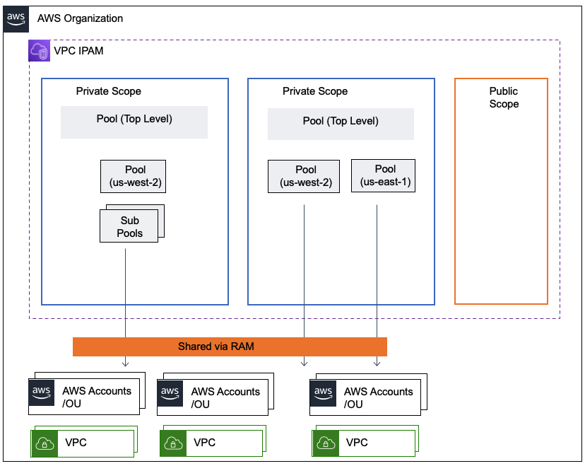

## Multiple Scopes

There are several reasons you may want to populate multiple IPAM scopes:

- Public & Private scope
- IPv4 + IPv6
- Overlapping IPv4 ranges

This example shows you how to build scopes for 2 overlapping IPv4 ranges that you want IPAM to manage. You do this by:

1. invoke module to build IPAM + ipv4 pool_configuration
2. create a new private scope on the IPAM built in step 1
3. invoke module with `create_ipam = false` and pass in the new scope id created

For IPv4 + IPv6, skip step 2. Reference the `public_default_scope_id` from the ipam in step 1 instead of creating a new scope.

