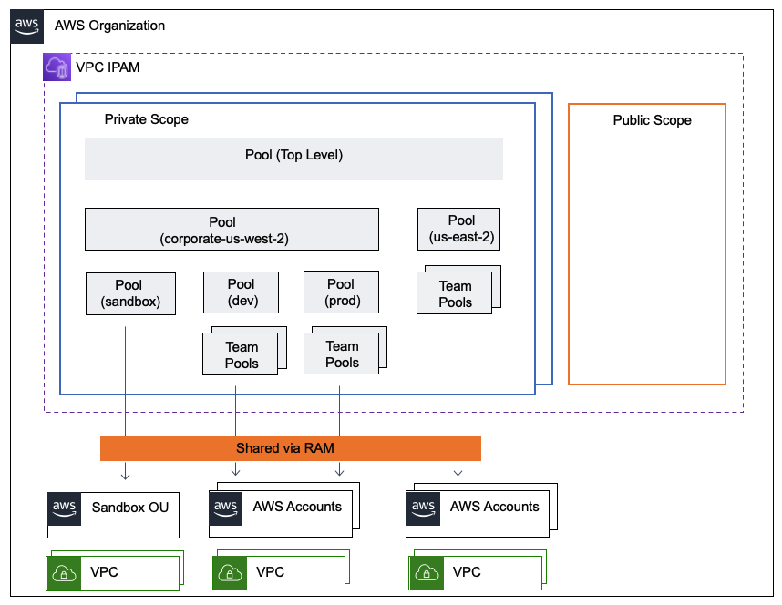

## Pool Design

The example code shows you how to deploy IPAM with pools in 2 regions. The company primarily uses `us-west-2` which has a sandbox pool that is shared to a sandbox OU where any developer can get their own account. It also has a dev pool that further sub-divides into business units. The prod pool also sub-divides into business units.

`us-east-1` is only used as a replicated prod and sub-divides into the same business unit pools as `us-west-2` prod.

